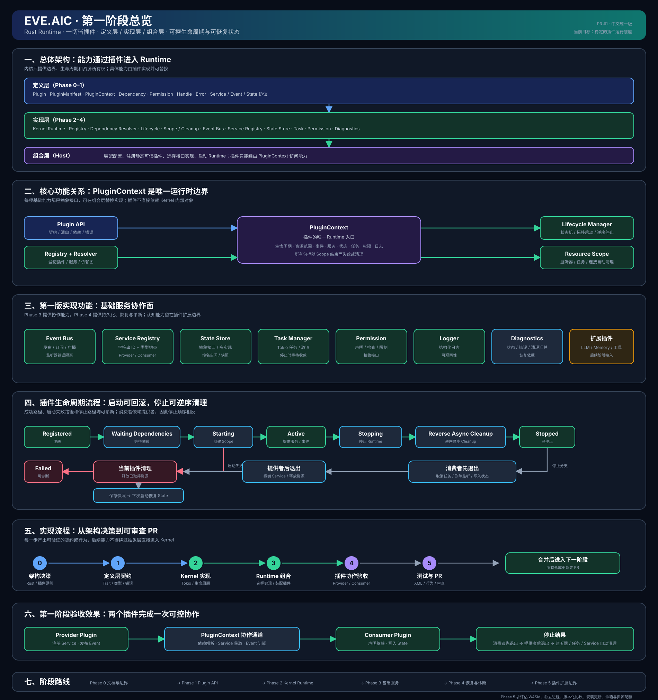

# EVE.AIC 文档中心

这里保存项目的长期设计、开发计划、执行记录和技术文档。

## 文档分类

- [偏好提炼](./偏好提炼.md)：低频候选、用户确认、预算、来源与失败恢复。

- [企划案](./企划案.md)：项目愿景、目标和范围。
- [开发计划](./开发计划.md)：阶段目标、优先级和完成条件。
- [持续认知与内生驱动](./认知循环.md)：统一主体、STATE/DRIVES/AGENDA、有界反思、可替换规划契约与恢复。
- [执行书](./执行书.md)：当前阶段的具体执行顺序和工作规则。
- [架构设计](./架构设计.md)：Rust Runtime、插件和内核边界。
- [决策记录](./决策记录.md)：已经确认的技术和架构决策。
- [AGENT 提示词](./AGENT提示词.md)：稳定身份来源、装配快照、版本和动态来源待办。
- [QQBot 通道](./QQBot通道.md)：官方 C2C/群 @、本地记忆与反思入口、去重恢复和停止。
- [QQ 成功交互观察](./QQ交互观察.md)：公开观察契约、Session Completed 与 QQ Sent 核对、失败不重试。
- [交互记忆与明确偏好](./交互记忆.md)：可信范围、查看/修正/撤销、证据与历史、Context 和失败恢复。
- [主动提问训练](./主动提问训练.md)：会话启停、内置表达统计、查看/重置、群 @ 与加密训练结果。
- [表达偏好与分段输出](./表达偏好与分段输出.md)：明确偏好、低频提炼、首版规则分段投递与恢复，以及分段与节奏学习计划。
- [核心对话](./核心对话.md)：主模型、AGENT、会话与工具的最小运行入口及验收。
- [LLM 工具调用](./LLM工具调用.md)：最小 Provider、上下文、工具和宿主循环契约。
- [任务控制](./任务控制.md)：显式取消、代际事件过滤、终态与副作用报告。
- [消息关系](./消息关系.md)：可替换判断、混合意图重规划、澄清引用及安全回退。
- [流式输出](./streaming.md)：Responses SSE、工具进度、背压及会话保存通知。
- [会话恢复](./会话恢复.md)：会话插件、完整工具历史、失败/取消及跨进程恢复。
- [模型配置](./模型配置.md)：四类模型角色、普通配置 Schema、固定快照与恢复边界。
- [配置管理](./配置管理.md)：内置配置插件、类型化读取、生效策略、备份与恢复，以及后续密钥能力边界。
- [性能测试](./性能测试.md)：自动 Release 基准、延迟/吞吐/资源、恢复场景和告警预算。
- [集成测试](./集成测试.md)：专用测试分支、PR 集成快照、离线验收命令与真实 API 接入前置条件。
- [OpenAI 接入](./OpenAI接入.md)：Responses 适配子集、宿主配置、错误和离线/真实验收。
- [待确认问题](./待确认问题.md)：尚未决定、需要逐步讨论的问题。
- [插件开发](./插件开发.md)：能力接口、后端装配和第一阶段验收示例。
- [日志接入](./日志接入.md)：结构化日志、后端选择、过滤与生命周期边界。
- [状态持久化](./状态持久化.md)：文件状态后端、原子提交、目录锁和独立进程恢复验收。
- [本地 PostgreSQL 状态](./PostgreSQL状态.md)：三个宿主的 SQL 选择、目录绑定、独占锁和独立测试库验收。
- [运行时诊断](./运行时诊断.md)：插件与任务查询、停止错误汇总与生命周期状态判定。
- [生命周期操作](./生命周期操作.md)：显式提交、取消等待、终态报告确认与执行器中断边界。
- [持续集成](./持续集成.md)：Windows、Linux、最低 Rust 版本检查与独立进程恢复验收。

## 第一阶段总览图

[打开 EVE.AIC 总览 SVG](./diagrams/eve-aic-overview.svg)

这张图把第一阶段需要讨论和验收的内容放在同一张图中：定义层、实现层和组合层的架构；核心功能关系；插件启动、失败回滚和逆序停止流程；从架构决策到 PR 的实现流程；Provider 与 Consumer 插件的协作效果；以及与《开发计划》一致的 Phase 0–5 路线。



## 当前状态

2026-10-05，已有内生反思与可替换规划、QQ 主动训练和表达统计、训练策略 v3、正式群提及与长消息 ID 修复。本轮已实现 QQ 有来源成功交互、明确偏好的查看/修正/撤销和按可信范围装配 Context；只有显式用户指令成为确认偏好，数值示范不代替确认。反思草稿只完成记录，不代表父目标执行完成或 AGI。事件、服务、状态、权限、任务、日志及独立进程恢复底座继续保留，详见[开发计划](./开发计划.md)。

[#97：排队输入跨训练启停与重置后的补学](https://github.com/ZenthXSin/Eve.aic/issues/97)已由 [PR #98](https://github.com/ZenthXSin/Eve.aic/pull/98) 修复并合入。SQL 后端与入口由 [PR #99](https://github.com/ZenthXSin/Eve.aic/pull/99)、[PR #102](https://github.com/ZenthXSin/Eve.aic/pull/102) 交付，QQ 反思由 [PR #101](https://github.com/ZenthXSin/Eve.aic/pull/101) 交付。三个宿主通过 `--database-config` 显式选择 SQL，默认文件状态且不自动迁移；QQ 的 `--memory` 与 `--cognition` 独立开启，共用所选 StateStore，各自独立提交。当前记忆不补采旧回执；追加 `--memory-learning` 可从已保存经历低频生成候选，只有用户明确确认才进入偏好。终端与 QQ 可用 `--segmented` 把同一轮回复按自然段分条投递，回执逐段记录、重启不补发，见[分段投递](./表达偏好与分段输出.md#首版分段投递已实现)。分段偏好学习、语义检索、目标执行和 AGI 质量评估继续推进。

任务支持前台、后台、定时与重复执行；插件可通过公开接口定义新任务类型和调度规则，扩展无需修改内核。详见[插件开发](./插件开发.md#自定义任务类型与调度)。

已建立的 Rust 插件 Runtime 底座：

```text
插件注册
    ↓
依赖解析
    ↓
插件生命周期
    ↓
Context 边界
    ↓
事件 / 服务 / 状态 / 任务
    ↓
清理 / 停止 / 恢复
```

插件扩展边界已具备静态工厂与目录。最小 LLM 工具闭环已经以无网络 Mock Provider 落地：Runtime 负责模型请求和工具调用批次循环，Provider 可替换，Context、Memory、Tool 和 Channel 继续作为插件能力。并行安全工具可在宿主上限内并发执行，串行作用域保持模型顺序，单项失败、超时或取消按调用 ID 隔离。Responses 文本/函数调用已通过本地 HTTP 和真实模型验收；会话插件、Runtime 多轮及工具历史恢复已完成本地验收，流式及工具进度已有本地 SSE、取消及恢复验收，reasoning 续传后置。详见[LLM 工具调用](./LLM工具调用.md)和[开发计划](./开发计划.md#phase-6最小-llm-工具闭环)。

- [主模型多轮验收](./主模型验收.md)：实际核心子进程、工具历史与重启，真实外部结果单独记录。
