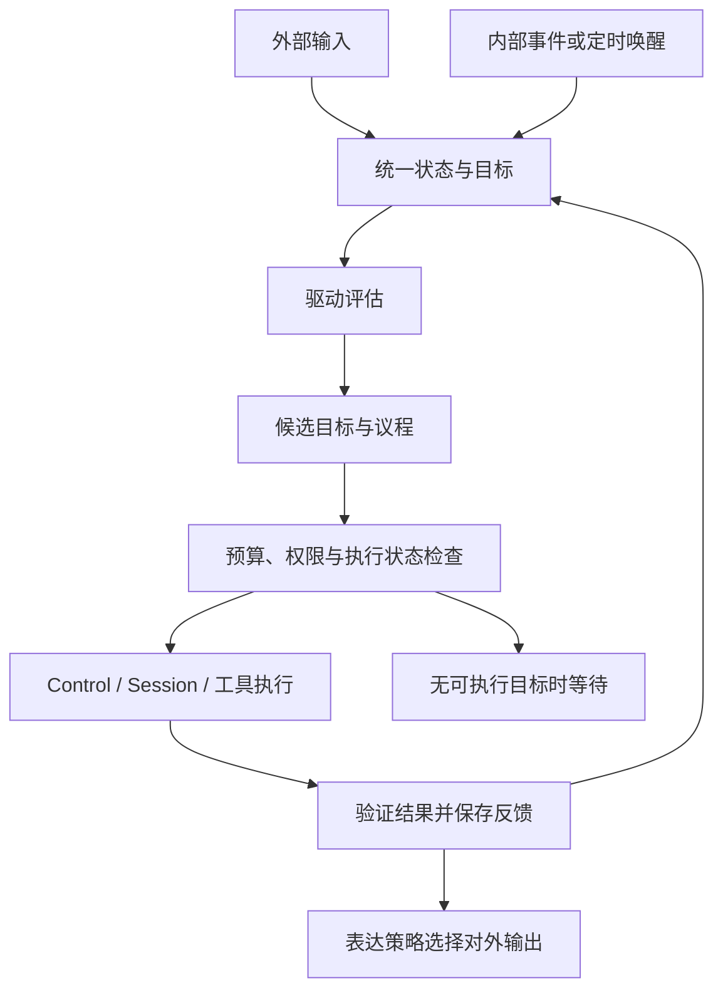

# 持续认知与内生驱动

状态：2026-10-02 确认的设计与实施计划；数据契约和持久化第一切片已随 PR #73 合入。首版规则驱动、有界唤醒与本地 Control 执行反馈闭环已在 PR #75 提供，实际验收进行中；生产 Context/QQ 接线、长期目标生成与学习仍待实现。已有底座为核心对话、Control、Session、普通配置、状态存储、事件和生命周期任务。每轮主模型解析在 PR #71 已实现并验收，本轮与认知数据底座整合；Jev 继续 TODO。

## 统一主体与两类交流

QQ、终端和内部循环连接同一个认知主体。主体具有统一的状态、目标与记忆入口；通道、Session、模型角色只承担来源、执行或能力职责。现有会话路由和恢复边界继续保留，首个切片不合并旧会话，也不迁移旧工具回执。

| 路径 | 示例 | 处理方式 |
| --- | --- | --- |
| 外部输入 | 用户消息、环境变化、工具结果 | 标注来源、权限及关联目标，更新可见状态 |
| 内部交流 | 状态变化、驱动评估、候选目标、议程、规划摘要、反馈 | 使用结构化事件和快照，必要时调用模型推演 |
| 外部输出 | 答复、进度、澄清、获准执行的行动 | 由表达与通道策略确定接收方，执行权限检查 |

交流记录至少带主体 ID、事件 ID、类型、来源、目标/任务关联、因果关联、修订、时间、作用范围和访问权限。来源区分用户提供、环境观察、工具结果与系统推断；访问范围随派生信息保留，不因进入统一主体而扩大。动态快照另带有效期，敏感正文不进入默认诊断日志。

内部交流不自动发给用户。对外只投递经过表达策略选择、与当前任务相关且有接收方的结果；内部唤醒、规划和反馈不能伪装成用户消息，模型推断也不能伪装成已验证事实。

## 定义、实现与组合

| 层 | 计划职责 | 边界 |
| --- | --- | --- |
| 定义层 | 独立认知 API：主体、事件、状态、驱动、议程、目标、反馈、公开服务和错误 | 不依赖厂商网络实现或 Kernel 私有状态 |
| 实现层 | 可替换的认知状态、驱动评估和议程策略插件 | 通过 Manifest、Service、Event、StateStore 和任务契约协作 |
| 组合层 | 映射通道来源，选择插件与模型角色，连接内部唤醒和 Control/Session | 不把认知业务加入 Kernel；复用已有执行与权限检查 |

首个实现采用一个状态插件持有统一快照和写入串行边界，策略通过公开契约替换；首版一个主体一次执行一个议程项。后续可替换存储和调度策略，但保持修订、失败及恢复语义。主体映射由组合层集中管理，不在 QQ、终端插件内分别硬编码人格。

内部任务使用标记为内部来源的执行上下文；短期仍借用现有 Session 执行适配器，记录认知目标与执行轮次的映射。统一认知状态不要求把所有历史直接拼入每次模型请求。

## STATE、DRIVES、AGENDA

| 数据 | 首个切片内容 | 更新依据 |
| --- | --- | --- |
| STATE | 当前目标、未完成事项、已知事实引用、执行/等待状态、资源和反馈摘要 | 带来源的事件、已保存执行报告和用户修正 |
| DRIVES | 驱动类型、强度、依据、适用范围、评估版本与有效期 | 目标差距、未完成事项和验证结果 |
| AGENDA | 候选/选中目标、优先级、预算、依赖、允许能力、选中理由和停止条件 | 状态与驱动快照、用户约束和执行可行性 |

这些是结构化运行数据，不是三个自动扫描的 Markdown 文件。稳定身份仍由 AGENT.md 提供；本轮动态内容按来源与权限进入 Context，不改变固定前缀、不授予新的工具权限，见[AGENT 提示词](./AGENT提示词.md)。

目标至少包括 ID、来源、作用范围、修订、内容/验证条件、状态、优先级、预算、停止条件、关联执行和反馈。完成状态由验证结果及持久化报告决定，不能仅依据模型说“已完成”。

首版驱动评估使用可替换的确定性规则：按未完成目标的可推进程度、等待时长和反馈变化产生关注强度。模型可建议目标或计划，建议须经过结构、来源、预算与权限检查。第一切片不模拟完整情绪或人格，也不要求复杂学习才能运行。

候选排序先排除失效、无权限、缺前置条件、等待信息或执行状态不确定的目标，再依据用户优先级、可推进性和驱动强度选择。强度只能影响排序；用户取消和明确约束直接限制议程。驱动公式、门槛和更新版本应可配置、可诊断。

## 唤醒与执行闭环



唤醒只提示重新评估，不等同于执行授权。事件合并、去重和队列长度有界；重复定时唤醒不能让同一目标并发提交。内部日志或无状态变化的输出不会递归触发新任务，避免自激循环。

每次激活固定状态/配置修订和预算，最多选一个目标、推进一个有界步骤。配置规定单次模型/工具次数、总期限、重试次数、冷却间隔及输入大小；缺少有效有限预算或停止条件时不得执行。无候选目标、预算耗尽、等待外部信息、取消或阻塞时转为等待，不持续调用模型自聊。

用户输入进入同一协调路径；首版明确取消停止相关执行，先等待 Control 的工具析构和会话收尾，再记录反馈。补充/纠正复用现有消息关系与副作用保护，暂停检查点和依赖图失效另行交付。停止插件时先关闭唤醒与新准入，再取消并等待在途执行及状态保存，沿用现有生命周期错误汇总。

辅助模型只提供受限结构化提取、摘要或判断；关闭、超时、不支持或格式错误时走显式规则/澄清路径并记录 warning。主模型承担规划，工具仍由宿主校验执行。关键状态、持久化或权限错误必须阻断相关目标，不能用 warning 假装完成。

## 持久化、恢复与失败

统一快照包含格式版本、主体和修订、目标/驱动/议程、去重与反馈摘要、执行关联及阻塞原因。公开更新带期望修订；同一插件串行写入，旧修订明确拒绝。通过公开 StateStore 保存整份快照，保存成功后才发布新修订和可执行事件。

- 未开始的 Ready 目标重启后可重新评估；已完成、已取消、过期或等待中的目标保持原状态。
- 执行前先保存执行中标记和尝试 ID，再通过 Control 准入；保存失败不得提交模型或工具。
- 返回后先核对完整报告、验证条件及会话提交结果，再保存反馈/终态，最后发完成事件。不完整报告、Pending/Unknown 或反馈保存失败将目标阻塞，保留已发生副作用的信息。
- 当前认知状态与 Session 没有跨插件事务。保存执行标记到获得执行关联、工具执行到保存反馈之间发生崩溃时，恢复标记为 Interrupted/Blocked；不能从“没有完成反馈”推断工具未执行。首版不承诺副作用恰好一次，也不自动重放此类目标。
- 恢复只重建订阅、服务、唤醒与可确认的状态；持久化轮次关联用于核对，旧进程的控制句柄不继续使用。后续人工/公开修复入口可核对证据后解除阻塞，首版不隐式修复。
- 损坏、未知版本、主体不一致或恢复失败保留原字节并报告错误，不清空或覆盖。日志只含必要 ID、修订、次数、期限和错误类别。

具体存储能力沿用[状态持久化](./状态持久化.md)，执行报告和取消语义沿用[任务控制](./任务控制.md)与[会话恢复](./会话恢复.md)。认知恢复的完成条件须与会话恢复共同验收。

## 分阶段交付与验收

1. **数据与持久化**：认知定义层、状态插件、公开快照/修订更新、来源权限、独立进程恢复示例。验证 Ready/完成/阻塞状态不混淆、修订冲突、保存失败以及损坏数据不覆盖。
2. **最小持续循环**：规则驱动、事件/定时唤醒、议程选择、有界 Control 执行、验证与反馈。验证没有新输入时推进一次任务、取消收尾、重复唤醒不重复执行、旧工具零重放，以及停止/崩溃窗口阻塞。
3. **交流与记忆接线**：QQ 明确命令、辅助模型、事实/经历持久化与基本检索分别交付；内部外部共用主体，但不同来源信息按权限读取/输出。语义 embedding/rerank 随后加入，不作为步骤 1–2 的依赖。
4. **长期能力评估**：扩展目标生成、学习、世界模型、自我模型与自我改进，分别建立可复验场景；不以模型自述评价完成度。Jev 保持 TODO。

首个完整验收场景：进程 A 保存一个未开始的本地目标并退出；进程 B 恢复，在没有新输入时选择目标，经现有模型/echo 工具链推进一次，保存验证结果和反馈。另一场景在执行中显式取消并等待收尾。再次启动检查完成目标不再提交，执行不确定目标被阻塞，内部记录零 QQ 自动广播。

本地 echo 与 loopback HTTP 验收证明调度、状态和执行闭环；真实模型的自主规划质量另用任务集评估。常规检查继续包含 Ubuntu/Windows、Rust 1.89、格式、严格 Clippy、相关测试与实际示例。对受影响 QQ/核心入口运行现有离线验收。

性能记录唤醒到准入、取消收尾和恢复延迟、单次模型/工具次数、空闲 CPU/RSS 与重复唤醒次数。资源预算超限告警，超时、重复执行、状态丢失或路由错误阻断验收，不将本地延迟当作真实模型/QQ 延迟。

## 数据与持久化第一切片

实现分为 [eve-cognition-api](../crates/cognition-api/src/lib.rs) 和 [eve-cognition-plugin](../crates/cognition-plugin/src/lib.rs)。定义层提供主体快照、来源、可见范围、目标、预算、执行关联、反馈、驱动力、议程和因果事件；实现层仅依赖公开 PluginContext/StateStore，不依赖 Kernel 或模型。Kernel 只在测试和组合示例中装配。

### 访问与更新

- 宿主构造 `CognitionPlugin::new("eve")`，保留 `controller()`。管理能力实现公开 `CognitionAdmin`，不注册到通用服务目录，也不传给模型或通道。
- 默认服务 `eve.cognition.public.v1` 发布 `CognitionReadHandle`，只能读取 Public 记录。宿主根据已验证来源创建 User/Internal 读句柄，权限绑定到句柄；读取请求没有可伪造的用户 ID 参数。
- User 视图包含公共记录和该用户记录；Internal 视图由受信宿主授予，供统一认知协调读取。目标、驱动力、事件和议程全部过滤；派生目标引用与事件因果引用不得扩大访问范围。公开视图的主体 ID 和全局修订仍可见。
- 来源身份认证由通道/宿主完成，本切片不提供登录认证、文件加密或不可信代码沙箱。数据来源和范围标注由受信写入方负责；引用检查不分析自然语言正文。
- 更新通过 `replace(expected_revision, state)` 提交整份状态，全局修订与目标修订由实现增加。旧修订、来源/权限变更、删除目标、改写已有事件、终态回到 Ready 均拒绝。
- 执行前保存 Executing 与 attempt/session/task 引用；在途目标的约束和预算固定。Completed 必须有轮次关联、Completed 提交与验证成功的反馈；取消在途目标需要反馈，Pending/Unknown 不能伪装成 Cancelled。
- 保存失败保持最后已提交的内存快照并返回 Storage。文件后端和验收后端同时保持原字节；自定义 StateStore 需保证失败不改写已有值，认知插件不对部分提交后端提供跨层回滚。

单主体最多一个 Executing。Ready 的到期时间在 `ready_goal_ids(now_ms)` 查询中检查；该查询只是候选过滤，不授予执行权限。此切片保存驱动强度、依据和议程，不计算驱动或主动调度。

### 格式、恢复和收尾

状态 namespace 为 `eve.cognition`，键为 `cognition.v1`，JSON 包含格式版本 1、主体、全局修订和完整状态。严格拒绝重复键、未知字段、未知版本、主体不匹配、非法引用或计数；恢复失败保留原字节。默认每类记录上限 256、快照上限 1 MiB，正文上限 8 KiB，计数溢出明确失败；归档/压缩另行交付，当前不自动删除记录。

仅 Executing 在启动时转为 Blocked/Interrupted，保留尝试与轮次引用，目标和全局修订增加；议程取消对该目标的选择。恢复变更先保存成功再发布服务。Ready、Waiting、Completed、Cancelled 和已有 Blocked 原样保留；无变化恢复不改写文件。停止或启动回滚关闭所有旧读句柄，并释放存储 Context；管理控制器在下一次启动绑定新服务，旧读句柄不会自动连接新服务。

此实现不发起模型/工具请求，也未装入生产终端/QQ 的认知循环。数据插件只校验结构与状态变更；首版循环通过独立执行器从实际 ControlReport 和配对工具回执生成反馈，见下节。

### 实际验收入口

```sh
cargo test -p eve-cognition-plugin --locked
cargo run -p eve-cognition-plugin --example cognition_state --locked -- /tmp/eve-cognition
cargo run -p eve-cognition-plugin --example cognition_state --locked -- /tmp/eve-cognition
cargo run -p eve-cognition-plugin --example cognition_state --locked -- /tmp/eve-cognition
```

三次独立进程分别保存四个来源不同的目标、恢复在途阻塞、验证无变化恢复，修订为 4 → 5 → 5；实际核对文件、读权限、旧句柄关闭与目录锁重开。完成目标是宿主状态机夹具，模型请求/工具执行均为零，不算自主任务验收。工作流在 Ubuntu/Windows 运行上述示例并逐次读取 state.json；集成测试另覆盖并发 CAS、保存失败、恢复保存失败、终态禁止重放、损坏数据和私有派生范围。


## 首版有界认知循环（PR #75）

定义层 [eve-cognition-loop-api](../crates/cognition-loop-api/src/lib.rs) 提供 DrivePolicy、GoalExecutor、GoalVerifier、宿主 LoopControl 与只读 LoopStatus；[内置循环插件](../crates/cognition-loop-plugin/src/lib.rs) 只依赖这些公开契约。组合层 [ControlGoalExecutor/BudgetedSessionRunner](../crates/runtime/src/cognition_executor.rs) 连接实际 Control/SessionLlmHost，每次尝试独立绑定 TurnBudget；模型与协议继续由宿主和每轮解析器提供。

### 准入与范围

- ExecutionScope 显式绑定主体、ReadAccess 和允许的来源 kind/channel；来源已由宿主认证，候选不能自报权限。过滤非 Ready、失效、范围不符、来源不符、未知验证规则和不支持的停止条件；无候选零模型请求、零状态重写。
- 首版 PriorityDrivePolicy 用优先级和临近期限排序，记录 Internal DRIVES/AGENDA 与理由；保留并发 CAS、单主体最多一个 Executing。插件占用的驱动 ID 前缀为 eve.loop.drive.，宿主需保留该命名空间。
- 首版验证器仅支持 verification=echo:<预期值>、stop_condition=single-attempt。完成必须是实际 Completed 提交、有效 turn_id、一项已启动 echo、匹配调用参数、配对回执和预期结果；模型回复文本不能充当验证证据。其他验证规则可以实现公开 GoalVerifier。
- 唤醒队列容量 1，重复状态信号合并；定时器跳过错过的 tick，不补发风暴。LOOP_WAKE_EVENT_ID 接受宿主提交状态后的提示；反馈事件使用另一个 ID，插件不订阅自身反馈作唤醒。日志不触发任务。
- LoopOptions 显式限制本次启动最多 1–32 个目标；示例取 1，每个目标仅一次尝试。目标预算 max_attempts 是上限，首版不启用重试或自动解阻塞，Completed/Cancelled/Blocked 不再执行。

### 实际预算与反馈

ExecutionLimits/TurnBudget 在每次模型请求前预留额度，在整批工具调用前检查工具总数及后续结果回传的模型额度。整批超限时零工具启动；未知或参数无效的调用也占准入额度，失败不退还。默认普通聊天未附加认知预算，现有 API 保持兼容。预算克隆保留共享工具槽位、串行队列与每轮固定 Provider，不创建绕过并发上限的新调度器。

总期限/到期/宿主取消发送 Control.cancel 并等待原 wait，之后才保存反馈或停止 Kernel。期限是停止新工作和请求取消的边界，收尾还需等待工具析构与会话提交；不将发出取消等同于已停止。取消与完成竞争按实际已提交、已验证结果处理，不能用 Cancelled 覆盖 Completed。

反馈保存成功后才发无正文的全局修订通知；通知失败只 warning，不改写已保存终态。Pending/Unknown、报告不完整或未验证的结果保留 Blocked。反馈保存失败停止循环并尽力保存 FeedbackSaveFailed；再次保存失败仍保留原 Executing，下一次状态插件恢复会标记 Interrupted/Blocked，不重放工具。尚无认知/Session 跨插件事务。

公开状态只含全局活动次数、期限与性能元数据，不含主体/用户/目标 ID 或正文；它不是按用户过滤的认知视图。模型/工具计数是已准入上界，started_tools 汇总已知实际启动数；HTTP 实际次数在验收替身中另计。

### 停止与独立进程验收

宿主先调用 controller.shutdown() 关闭唤醒、取消并等待，再停止 Kernel。停止后卸载循环和控制组合插件，释放执行器持有的 Kernel 引用。旧公开状态句柄失效；旧宿主控制句柄不能唤醒新实例，宿主在停止前可读取最终统计。

```sh
cargo test -p eve-runtime --test cognition_loop --locked
cargo run -p eve-runtime --example cognition_loop --locked -- /tmp/eve-cognition-loop seed
cargo run -p eve-runtime --example cognition_loop --locked -- /tmp/eve-cognition-loop run
cargo run -p eve-runtime --example cognition_loop --locked -- /tmp/eve-cognition-loop run
cargo run -p eve-runtime --example cognition_loop --locked -- /tmp/eve-cognition-cancel cancel
```

seed 保存 Ready（revision 1）；第二进程不读取 stdin，使用真实 OpenAiProvider 的 loopback Chat、Control、Session 和 echo，保存 Completed/验证反馈（revision 3）；第三进程不请求模型、不执行工具，磁盘不变（revision 3）。取消入口等待实际工具析构。完整 CI 在 Ubuntu/Windows 执行并读取实际 state.json；十项集成场景包含预算拒绝、模型假完成、访问/来源/期限/等待过滤、取消与完成竞争、保存失败/重启阻塞、Pending、无效模型与排序/启动预算。具体通过结果以 PR 检查为准。

首版使用独立组合验收入口，尚未装入生产终端/QQ，不生成新的自然语言目标、不自动向外发送内部记录。SQLite 分层记忆、自动上下文压缩与语义检索后续分别交付；当前仍使用 FileStateStore。认知性能口径见[性能测试](./性能测试.md#认知循环性能)。
