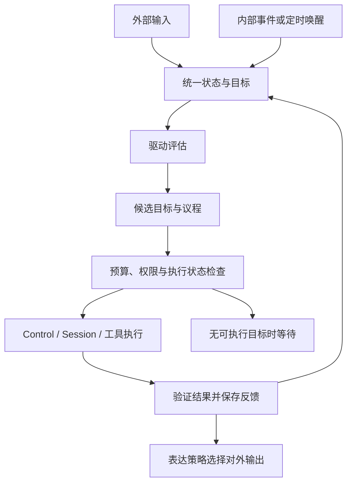

# 持续认知与内生驱动

状态：2026-10-02 确认的设计与实施计划；本文件不代表认知插件或自主循环已经实现。已有底座为核心对话、Control、Session、普通配置、状态存储、事件和生命周期任务。每轮主模型解析在 PR #71 已验收、尚未合入；Jev 继续 TODO。

## 统一主体与两类交流

QQ、终端和内部循环连接同一个认知主体。主体具有统一的状态、目标与记忆入口；通道、Session、模型角色只承担来源、执行或能力职责。现有会话路由和恢复边界继续保留，首个切片不合并旧会话，也不迁移旧工具回执。

| 路径 | 示例 | 处理方式 |
| --- | --- | --- |
| 外部输入 | 用户消息、环境变化、工具结果 | 标注来源、权限及关联目标，更新可见状态 |
| 内部交流 | 状态变化、驱动评估、候选目标、议程、规划摘要、反馈 | 使用结构化事件和快照，必要时调用模型推演 |
| 外部输出 | 答复、进度、澄清、获准执行的行动 | 由表达与通道策略确定接收方，执行权限检查 |

交流记录至少带主体 ID、事件 ID、类型、来源、目标/任务关联、因果关联、修订、时间、作用范围和访问权限。来源区分用户提供、环境观察、工具结果与系统推断；访问范围随派生信息保留，不因进入统一主体而扩大。动态快照另带有效期，敏感正文不进入默认诊断日志。

内部交流不自动发给用户。对外只投递经过表达策略选择、与当前任务相关且有接收方的结果；内部唤醒、规划和反馈不能伪装成用户消息，模型推断也不能伪装成已验证事实。

## 定义、实现与组合

| 层 | 计划职责 | 边界 |
| --- | --- | --- |
| 定义层 | 独立认知 API：主体、事件、状态、驱动、议程、目标、反馈、公开服务和错误 | 不依赖厂商网络实现或 Kernel 私有状态 |
| 实现层 | 可替换的认知状态、驱动评估和议程策略插件 | 通过 Manifest、Service、Event、StateStore 和任务契约协作 |
| 组合层 | 映射通道来源，选择插件与模型角色，连接内部唤醒和 Control/Session | 不把认知业务加入 Kernel；复用已有执行与权限检查 |

首个实现采用一个状态插件持有统一快照和写入串行边界，策略通过公开契约替换；首版一个主体一次执行一个议程项。后续可替换存储和调度策略，但保持修订、失败及恢复语义。主体映射由组合层集中管理，不在 QQ、终端插件内分别硬编码人格。

内部任务使用标记为内部来源的执行上下文；短期仍借用现有 Session 执行适配器，记录认知目标与执行轮次的映射。统一认知状态不要求把所有历史直接拼入每次模型请求。

## STATE、DRIVES、AGENDA

| 数据 | 首个切片内容 | 更新依据 |
| --- | --- | --- |
| STATE | 当前目标、未完成事项、已知事实引用、执行/等待状态、资源和反馈摘要 | 带来源的事件、已保存执行报告和用户修正 |
| DRIVES | 驱动类型、强度、依据、适用范围、评估版本与有效期 | 目标差距、未完成事项和验证结果 |
| AGENDA | 候选/选中目标、优先级、预算、依赖、允许能力、选中理由和停止条件 | 状态与驱动快照、用户约束和执行可行性 |

这些是结构化运行数据，不是三个自动扫描的 Markdown 文件。稳定身份仍由 AGENT.md 提供；本轮动态内容按来源与权限进入 Context，不改变固定前缀、不授予新的工具权限，见[AGENT 提示词](./AGENT提示词.md)。

目标至少包括 ID、来源、作用范围、修订、内容/验证条件、状态、优先级、预算、停止条件、关联执行和反馈。完成状态由验证结果及持久化报告决定，不能仅依据模型说“已完成”。

首版驱动评估使用可替换的确定性规则：按未完成目标的可推进程度、等待时长和反馈变化产生关注强度。模型可建议目标或计划，建议须经过结构、来源、预算与权限检查。第一切片不模拟完整情绪或人格，也不要求复杂学习才能运行。

候选排序先排除失效、无权限、缺前置条件、等待信息或执行状态不确定的目标，再依据用户优先级、可推进性和驱动强度选择。强度只能影响排序；用户取消和明确约束直接限制议程。驱动公式、门槛和更新版本应可配置、可诊断。

## 唤醒与执行闭环

唤醒只提示重新评估，不等同于执行授权。事件合并、去重和队列长度有界；重复定时唤醒不能让同一目标并发提交。内部日志或无状态变化的输出不会递归触发新任务，避免自激循环。

每次激活固定状态/配置修订和预算，最多选一个目标、推进一个有界步骤。配置规定单次模型/工具次数、总期限、重试次数、冷却间隔及输入大小；缺少有效有限预算或停止条件时不得执行。无候选目标、预算耗尽、等待外部信息、取消或阻塞时转为等待，不持续调用模型自聊。

用户输入进入同一协调路径；首版明确取消停止相关执行，先等待 Control 的工具析构和会话收尾，再记录反馈。补充/纠正复用现有消息关系与副作用保护，暂停检查点和依赖图失效另行交付。停止插件时先关闭唤醒与新准入，再取消并等待在途执行及状态保存，沿用现有生命周期错误汇总。

辅助模型只提供受限结构化提取、摘要或判断；关闭、超时、不支持或格式错误时走显式规则/澄清路径并记录 warning。主模型承担规划，工具仍由宿主校验执行。关键状态、持久化或权限错误必须阻断相关目标，不能用 warning 假装完成。

## 持久化、恢复与失败

统一快照包含格式版本、主体和修订、目标/驱动/议程、去重与反馈摘要、执行关联及阻塞原因。公开更新带期望修订；同一插件串行写入，旧修订明确拒绝。通过公开 StateStore 保存整份快照，保存成功后才发布新修订和可执行事件。

- 未开始的 Ready 目标重启后可重新评估；已完成、已取消、过期或等待中的目标保持原状态。
- 执行前先保存执行中标记和尝试 ID，再通过 Control 准入；保存失败不得提交模型或工具。
- 返回后先核对完整报告、验证条件及会话提交结果，再保存反馈/终态，最后发完成事件。不完整报告、Pending/Unknown 或反馈保存失败将目标阻塞，保留已发生副作用的信息。
- 当前认知状态与 Session 没有跨插件事务。保存执行标记到获得执行关联、工具执行到保存反馈之间发生崩溃时，恢复标记为 Interrupted/Blocked；不能从“没有完成反馈”推断工具未执行。首版不承诺副作用恰好一次，也不自动重放此类目标。
- 恢复只重建订阅、服务、唤醒与可确认的状态；持久化轮次关联用于核对，旧进程的控制句柄不继续使用。后续人工/公开修复入口可核对证据后解除阻塞，首版不隐式修复。
- 损坏、未知版本、主体不一致或恢复失败保留原字节并报告错误，不清空或覆盖。日志只含必要 ID、修订、次数、期限和错误类别。

具体存储能力沿用[状态持久化](./状态持久化.md)，执行报告和取消语义沿用[任务控制](./任务控制.md)与[会话恢复](./会话恢复.md)。认知恢复的完成条件须与会话恢复共同验收。

## 分阶段交付与验收

1. **数据与持久化**：认知定义层、状态插件、公开快照/修订更新、来源权限、独立进程恢复示例。验证 Ready/完成/阻塞状态不混淆、修订冲突、保存失败以及损坏数据不覆盖。
2. **最小持续循环**：规则驱动、事件/定时唤醒、议程选择、有界 Control 执行、验证与反馈。验证没有新输入时推进一次任务、取消收尾、重复唤醒不重复执行、旧工具零重放，以及停止/崩溃窗口阻塞。
3. **交流与记忆接线**：QQ 明确命令、辅助模型、事实/经历持久化与基本检索分别交付；内部外部共用主体，但不同来源信息按权限读取/输出。语义 embedding/rerank 随后加入，不作为步骤 1–2 的依赖。
4. **长期能力评估**：扩展目标生成、学习、世界模型、自我模型与自我改进，分别建立可复验场景；不以模型自述评价完成度。Jev 保持 TODO。

首个完整验收场景：进程 A 保存一个未开始的本地目标并退出；进程 B 恢复，在没有新输入时选择目标，经现有模型/echo 工具链推进一次，保存验证结果和反馈。另一场景在执行中显式取消并等待收尾。再次启动检查完成目标不再提交，执行不确定目标被阻塞，内部记录零 QQ 自动广播。

本地 echo 与 loopback HTTP 验收证明调度、状态和执行闭环；真实模型的自主规划质量另用任务集评估。常规检查继续包含 Ubuntu/Windows、Rust 1.89、格式、严格 Clippy、相关测试与实际示例。对受影响 QQ/核心入口运行现有离线验收。

性能记录唤醒到准入、取消收尾和恢复延迟、单次模型/工具次数、空闲 CPU/RSS 与重复唤醒次数。资源预算超限告警，超时、重复执行、状态丢失或路由错误阻断验收，不将本地延迟当作真实模型/QQ 延迟。
