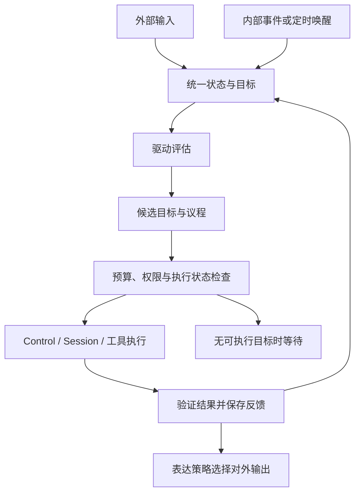

# 持续认知与内生驱动

状态：2026-10-05，数据与持久化 #73、有界循环 #75、期限修复 #80、生产反思 #82、可替换规划 #83 和 QQ `--cognition` 入口 #101 已合入；#99、#102 提供三个宿主的显式 SQL 选择。本轮增加 QQ `--memory`：保存有来源的成功交互，提供明确偏好查看、修正、撤销与按可信范围装配 Context。反思仍只从未解决事项产出一次可查看草稿，父目标保持 Waiting。低频偏好提炼、语义检索、目标分解、计划执行、环境学习与 AGI 质量评估继续推进；当前能力不等于已实现 AGI。已有 Control、Session、每轮主模型解析和恢复边界继续复用；QQ 辅助模型后置，Jev 保持 TODO。

## 统一主体与两类交流

QQ、终端和内部循环连接同一个认知主体。主体具有统一的状态、目标与记忆入口；通道、Session、模型角色只承担来源、执行或能力职责。现有会话路由和恢复边界继续保留，首个切片不合并旧会话，也不迁移旧工具回执。

| 路径 | 示例 | 处理方式 |
| --- | --- | --- |
| 外部输入 | 用户消息、环境变化、工具结果 | 标注来源、权限及关联目标，更新可见状态 |
| 内部交流 | 状态变化、驱动评估、候选目标、议程、规划摘要、反馈 | 使用结构化事件和快照，必要时调用模型推演 |
| 外部输出 | 答复、进度、澄清、获准执行的行动 | 由表达与通道策略确定接收方，执行权限检查 |

交流记录至少带主体 ID、事件 ID、类型、来源、目标/任务关联、因果关联、修订、时间、作用范围和访问权限。来源区分用户提供、环境观察、工具结果与系统推断；访问范围随派生信息保留，不因进入统一主体而扩大。动态快照另带有效期，敏感正文不进入默认诊断日志。

内部交流不自动发给用户。对外只投递经过表达策略选择、与当前任务相关且有接收方的结果；内部唤醒、规划和反馈不能伪装成用户消息，模型推断也不能伪装成已验证事实。

## 定义、实现与组合

| 层 | 计划职责 | 边界 |
| --- | --- | --- |
| 定义层 | 独立认知 API：主体、事件、状态、驱动、议程、目标、反馈、公开服务和错误 | 不依赖厂商网络实现或 Kernel 私有状态 |
| 实现层 | 可替换的认知状态、驱动评估和议程策略插件 | 通过 Manifest、Service、Event、StateStore 和任务契约协作 |
| 组合层 | 映射通道来源，选择插件与模型角色，连接内部唤醒和 Control/Session | 不把认知业务加入 Kernel；复用已有执行与权限检查 |

首个实现采用一个状态插件持有统一快照和写入串行边界，策略通过公开契约替换；首版一个主体一次执行一个议程项。后续可替换存储和调度策略，但保持修订、失败及恢复语义。主体映射由组合层集中管理，不在 QQ、终端插件内分别硬编码人格。

内部任务使用标记为内部来源的执行上下文；短期仍借用现有 Session 执行适配器，记录认知目标与执行轮次的映射。统一认知状态不要求把所有历史直接拼入每次模型请求。

## STATE、DRIVES、AGENDA

| 数据 | 首个切片内容 | 更新依据 |
| --- | --- | --- |
| STATE | 当前目标、未完成事项、已知事实引用、执行/等待状态、资源和反馈摘要 | 带来源的事件、已保存执行报告和用户修正 |
| DRIVES | 驱动类型、强度、依据、适用范围、评估版本与有效期 | 目标差距、未完成事项和验证结果 |
| AGENDA | 候选/选中目标、优先级、预算、依赖、允许能力、选中理由和停止条件 | 状态与驱动快照、用户约束和执行可行性 |

这些是结构化运行数据，不是三个自动扫描的 Markdown 文件。稳定身份仍由 AGENT.md 提供；本轮动态内容按来源与权限进入 Context，不改变固定前缀、不授予新的工具权限，见[AGENT 提示词](./AGENT提示词.md)。

目标至少包括 ID、来源、作用范围、修订、内容/验证条件、状态、优先级、预算、停止条件、关联执行和反馈。完成状态由验证结果及持久化报告决定，不能仅依据模型说“已完成”。

首版驱动评估使用可替换的确定性规则：按未完成目标的可推进程度、等待时长和反馈变化产生关注强度。模型可建议目标或计划，建议须经过结构、来源、预算与权限检查。第一切片不模拟完整情绪或人格，也不要求复杂学习才能运行。

候选排序先排除失效、无权限、缺前置条件、等待信息或执行状态不确定的目标，再依据用户优先级、可推进性和驱动强度选择。强度只能影响排序；用户取消和明确约束直接限制议程。驱动公式、门槛和更新版本应可配置、可诊断。

## 唤醒与执行闭环



唤醒只提示重新评估，不等同于执行授权。事件合并、去重和队列长度有界；重复定时唤醒不能让同一目标并发提交。内部日志或无状态变化的输出不会递归触发新任务，避免自激循环。

每次激活固定状态/配置修订和预算，最多选一个目标、推进一个有界步骤。配置规定单次模型/工具次数、总期限、重试次数、冷却间隔及输入大小；缺少有效有限预算或停止条件时不得执行。无候选目标、预算耗尽、等待外部信息、取消或阻塞时转为等待，不持续调用模型自聊。

用户输入进入同一协调路径；首版明确取消停止相关执行，先等待 Control 的工具析构和会话收尾，再记录反馈。补充/纠正复用现有消息关系与副作用保护，暂停检查点和依赖图失效另行交付。停止插件时先关闭唤醒与新准入，再取消并等待在途执行及状态保存，沿用现有生命周期错误汇总。

辅助模型只提供受限结构化提取、摘要或判断；关闭、超时、不支持或格式错误时走显式规则/澄清路径并记录 warning。主模型承担规划，工具仍由宿主校验执行。关键状态、持久化或权限错误必须阻断相关目标，不能用 warning 假装完成。

## 持久化、恢复与失败

统一快照包含格式版本、主体和修订、目标/驱动/议程、去重与反馈摘要、执行关联及阻塞原因。公开更新带期望修订；同一插件串行写入，旧修订明确拒绝。通过公开 StateStore 保存整份快照，保存成功后才发布新修订和可执行事件。

- 未开始的 Ready 目标重启后可重新评估；已完成、已取消、过期或等待中的目标保持原状态。
- 执行前先保存执行中标记和尝试 ID，再通过 Control 准入；保存失败不得提交模型或工具。
- 返回后先核对完整报告、验证条件及会话提交结果，再保存反馈/终态，最后发完成事件。不完整报告、Pending/Unknown 或反馈保存失败将目标阻塞，保留已发生副作用的信息。
- 当前认知状态与 Session 没有跨插件事务。保存执行标记到获得执行关联、工具执行到保存反馈之间发生崩溃时，恢复标记为 Interrupted/Blocked；不能从“没有完成反馈”推断工具未执行。首版不承诺副作用恰好一次，也不自动重放此类目标。
- 恢复只重建订阅、服务、唤醒与可确认的状态；持久化轮次关联用于核对，旧进程的控制句柄不继续使用。后续人工/公开修复入口可核对证据后解除阻塞，首版不隐式修复。
- 损坏、未知版本、主体不一致或恢复失败保留原字节并报告错误，不清空或覆盖。日志只含必要 ID、修订、次数、期限和错误类别。

具体存储能力沿用[状态持久化](./状态持久化.md)，执行报告和取消语义沿用[任务控制](./任务控制.md)与[会话恢复](./会话恢复.md)。认知恢复的完成条件须与会话恢复共同验收。

## 分阶段交付与验收

1. **数据与持久化**：认知定义层、状态插件、公开快照/修订更新、来源权限、独立进程恢复示例。验证 Ready/完成/阻塞状态不混淆、修订冲突、保存失败以及损坏数据不覆盖。
2. **最小持续循环**：规则驱动、事件/定时唤醒、议程选择、有界 Control 执行、验证与反馈。验证没有新输入时推进一次任务、取消收尾、重复唤醒不重复执行、旧工具零重放，以及停止/崩溃窗口阻塞。
3. **内生差距发现与反思记录（已交付）**：生产入口保存 Waiting 父目标，在没有新消息时按来源和范围派生一次反思子目标；真实主模型输出受限 JSON 草稿，保存到本地 Session 并可查看。子目标完成只表示反思记录通过验证，父目标仍 Waiting。
4. **交互记忆与后续目标执行**：已实现有来源成功交互、明确偏好的查看/修正/撤销，以及受范围约束的 Context；文件与本地 SQL 后端均可使用，不自动提炼偏好或补采旧回执，见[交互记忆](./交互记忆.md)。下一步将草稿建议连接前置条件、预算、权限和外部验证，另行推进低频提炼、语义检索、环境反馈与分段投递，设计见[专项计划](./表达偏好与分段输出.md)。QQ 辅助模型和 embedding/rerank 不作为当前切片的前置依赖。
5. **长期能力评估**：扩展长期学习、世界模型、自我模型与自我改进，分别建立可复验场景；不以模型自述或几轮反思评价 AGI。Jev 保持 TODO。

首个完整验收场景：进程 A 保存一个未开始的本地目标并退出；进程 B 恢复，在没有新输入时选择目标，经现有模型/echo 工具链推进一次，保存验证结果和反馈。另一场景在执行中显式取消并等待收尾。再次启动检查完成目标不再提交，执行不确定目标被阻塞，内部记录零 QQ 自动广播。

本地 echo 与 loopback HTTP 验收证明调度、状态和执行闭环；真实模型的自主规划质量另用任务集评估。常规检查继续包含 Ubuntu/Windows、Rust 1.89、格式、严格 Clippy、相关测试与实际示例。对受影响 QQ/核心入口运行现有离线验收。

性能记录唤醒到准入、取消收尾和恢复延迟、单次模型/工具次数、空闲 CPU/RSS 与重复唤醒次数。资源预算超限告警，超时、重复执行、状态丢失或路由错误阻断验收，不将本地延迟当作真实模型/QQ 延迟。

## 数据与持久化第一切片

实现分为 [eve-cognition-api](../crates/cognition-api/src/lib.rs) 和 [eve-cognition-plugin](../crates/cognition-plugin/src/lib.rs)。定义层提供主体快照、来源、可见范围、目标、预算、执行关联、反馈、驱动力、议程和因果事件；实现层仅依赖公开 PluginContext/StateStore，不依赖 Kernel 或模型。Kernel 只在测试和组合示例中装配。

### 访问与更新

- 宿主构造 `CognitionPlugin::new("eve")`，保留 `controller()`。管理能力实现公开 `CognitionAdmin`，不注册到通用服务目录，也不传给模型或通道。
- 默认服务 `eve.cognition.public.v1` 发布 `CognitionReadHandle`，只能读取 Public 记录。宿主根据已验证来源创建 User/Internal 读句柄，权限绑定到句柄；读取请求没有可伪造的用户 ID 参数。
- User 视图包含公共记录和该用户记录；Internal 视图由受信宿主授予，供统一认知协调读取。目标、驱动力、事件和议程全部过滤；派生目标引用与事件因果引用不得扩大访问范围。公开视图的主体 ID 和全局修订仍可见。
- 来源身份认证由通道/宿主完成，本切片不提供登录认证、文件加密或不可信代码沙箱。数据来源和范围标注由受信写入方负责；引用检查不分析自然语言正文。
- 更新通过 `replace(expected_revision, state)` 提交整份状态，全局修订与目标修订由实现增加。旧修订、来源/权限变更、删除目标、改写已有事件、终态回到 Ready 均拒绝。
- 执行前保存 Executing 与 attempt/session/task 引用；在途目标的约束和预算固定。Completed 必须有轮次关联、Completed 提交与验证成功的反馈；取消在途目标需要反馈，Pending/Unknown 不能伪装成 Cancelled。
- 保存失败保持最后已确认的内存快照并返回 Storage。文件后端和验收后端同时保持原字节；PostgreSQL 提交报错可能发生在数据库已经写入之后，不能根据旧内存快照推断回滚。SQL 后端此时关闭且不自动重连，宿主停止后显式重启读取实际持久化状态；认知插件不提供跨层回滚。详见[PostgreSQL 提交失败与恢复](./PostgreSQL状态.md#提交失败与恢复)。

单主体最多一个 Executing。Ready 的到期时间在 `ready_goal_ids(now_ms)` 查询中检查；该查询只是候选过滤，不授予执行权限。此切片保存驱动强度、依据和议程，不计算驱动或主动调度。

### 格式、恢复和收尾

状态 namespace 为 `eve.cognition`，键为 `cognition.v1`，JSON 包含格式版本 1、主体、全局修订和完整状态。严格拒绝重复键、未知字段、未知版本、主体不匹配、非法引用或计数；恢复失败保留原字节。默认每类记录上限 256、快照上限 1 MiB，正文上限 8 KiB，计数溢出明确失败；归档/压缩另行交付，当前不自动删除记录。

仅 Executing 在启动时转为 Blocked/Interrupted，保留尝试与轮次引用，目标和全局修订增加；议程取消对该目标的选择。恢复变更先保存成功再发布服务。Ready、Waiting、Completed、Cancelled 和已有 Blocked 原样保留；无变化恢复不改写文件。停止或启动回滚关闭所有旧读句柄，并释放存储 Context；管理控制器在下一次启动绑定新服务，旧读句柄不会自动连接新服务。

数据插件自身不发起模型/工具请求，只校验结构与状态变更。首版循环通过独立执行器从实际 ControlReport 和配对工具回执生成反馈；生产内生反思入口再装配受限的主模型与草稿验证器。普通终端和 QQ 不因此自动启动后台认知或广播内部记录。

### 实际验收入口

```sh
cargo test -p eve-cognition-plugin --locked
cargo run -p eve-cognition-plugin --example cognition_state --locked -- /tmp/eve-cognition
cargo run -p eve-cognition-plugin --example cognition_state --locked -- /tmp/eve-cognition
cargo run -p eve-cognition-plugin --example cognition_state --locked -- /tmp/eve-cognition
```

三次独立进程分别保存四个来源不同的目标、恢复在途阻塞、验证无变化恢复，修订为 4 → 5 → 5；实际核对文件、读权限、旧句柄关闭与目录锁重开。完成目标是宿主状态机夹具，模型请求/工具执行均为零，不算自主任务验收。工作流在 Ubuntu/Windows 运行上述示例并逐次读取 state.json；集成测试另覆盖并发 CAS、保存失败、恢复保存失败、终态禁止重放、损坏数据和私有派生范围。


## 首版有界认知循环（PR #75）

定义层 [eve-cognition-loop-api](../crates/cognition-loop-api/src/lib.rs) 提供 DrivePolicy、GoalExecutor、GoalVerifier、宿主 LoopControl 与只读 LoopStatus；[内置循环插件](../crates/cognition-loop-plugin/src/lib.rs) 只依赖这些公开契约。组合层 [ControlGoalExecutor/BudgetedSessionRunner](../crates/runtime/src/cognition_executor.rs) 连接实际 Control/SessionLlmHost，每次尝试独立绑定 TurnBudget；模型与协议继续由宿主和每轮解析器提供。

### 准入与范围

- ExecutionScope 显式绑定主体、ReadAccess 和允许的来源 kind/channel；来源已由宿主认证，候选不能自报权限。过滤非 Ready、失效、范围不符、来源不符、未知验证规则和不支持的停止条件；无候选零模型请求、零状态重写。
- 首版 PriorityDrivePolicy 用优先级和临近期限排序，记录 Internal DRIVES/AGENDA 与理由；保留并发 CAS、单主体最多一个 Executing。插件占用的驱动 ID 前缀为 eve.loop.drive.，宿主需保留该命名空间。
- 首版验证器仅支持 verification=echo:<预期值>、stop_condition=single-attempt。完成必须是实际 Completed 提交、有效 turn_id、一项已启动 echo、匹配调用参数、配对回执和预期结果；模型回复文本不能充当验证证据。其他验证规则可以实现公开 GoalVerifier。
- 唤醒队列容量 1，重复状态信号合并；定时器跳过错过的 tick，不补发风暴。LOOP_WAKE_EVENT_ID 接受宿主提交状态后的提示；反馈事件使用另一个 ID，插件不订阅自身反馈作唤醒。日志不触发任务。
- LoopOptions 显式限制本次启动最多 1–32 个目标；示例取 1，每个目标仅一次尝试。目标预算 max_attempts 是上限，首版不启用重试或自动解阻塞，Completed/Cancelled/Blocked 不再执行。

### 实际预算与反馈

ExecutionLimits/TurnBudget 在每次模型请求前预留额度，在整批工具调用前检查工具总数及后续结果回传的模型额度。整批超限时零工具启动；未知或参数无效的调用也占准入额度，失败不退还。默认普通聊天未附加认知预算，现有 API 保持兼容。预算克隆保留共享工具槽位、串行队列与每轮固定 Provider，不创建绕过并发上限的新调度器。

总期限/到期/宿主取消发送 Control.cancel 并等待原 wait，之后才保存反馈或停止 Kernel。期限是停止新工作和请求取消的边界，收尾还需等待工具析构与会话提交；不将发出取消等同于已停止。取消与完成竞争按实际已提交、已验证结果处理，不能用 Cancelled 覆盖 Completed。

反馈保存成功后才发无正文的全局修订通知；通知失败只 warning，不改写已保存终态。Pending/Unknown、报告不完整或未验证的结果保留 Blocked。反馈保存失败停止循环并尽力保存 FeedbackSaveFailed；再次保存失败时内存仍保留原 Executing。文件后端重启将其标记 Interrupted/Blocked；SQL 后端可能已提交终态，重启必须读取实际字节，不能凭旧内存报告断定数据库仍是 Executing。两者均不重放工具，尚无认知/Session 跨插件事务。

公开状态只含全局活动次数、期限与性能元数据，不含主体/用户/目标 ID 或正文；它不是按用户过滤的认知视图。模型/工具计数是已准入上界，started_tools 汇总已知实际启动数；HTTP 实际次数在验收替身中另计。

### 停止与独立进程验收

宿主先调用 controller.shutdown() 关闭唤醒、取消并等待，再停止 Kernel。停止后卸载循环和控制组合插件，释放执行器持有的 Kernel 引用。旧公开状态句柄失效；同一插件 stop/start 时宿主管理控制器绑定新实例；卸载重建需要重新取得控制器。旧公开状态句柄不会重连，宿主在停止前可读取最终统计。

```sh
cargo test -p eve-runtime --test cognition_loop --locked
cargo run -p eve-runtime --example cognition_loop --locked -- /tmp/eve-cognition-loop seed
cargo run -p eve-runtime --example cognition_loop --locked -- /tmp/eve-cognition-loop run
cargo run -p eve-runtime --example cognition_loop --locked -- /tmp/eve-cognition-loop run
cargo run -p eve-runtime --example cognition_loop --locked -- /tmp/eve-cognition-cancel cancel
```

seed 保存 Ready（revision 1）；第二进程不读取 stdin，使用真实 OpenAiProvider 的 loopback Chat、Control、Session 和 echo，保存 Completed/验证反馈（revision 3）；第三进程不请求模型、不执行工具，磁盘不变（revision 3）。取消入口等待实际工具析构。完整 CI 在 Ubuntu/Windows 执行并读取实际 state.json；十三项集成场景包含预算拒绝、模型假完成、访问/来源/期限/等待过滤、取消与完成竞争、保存失败/重启阻塞、Pending、无效模型、排序/启动预算和服务冲突回滚。2026-10-02 [完整 CI](https://github.com/ZenthXSin/Eve.aic/actions/runs/37007247468) 已通过：Ubuntu/Windows 的十三项场景、完整工作区/文档测试、格式、严格 Clippy、全部既有示例及三次独立进程验收，Rust 1.89 全目标编译成功。实现 head `aeede1311bbd4f35dafb2e71b4337117391271ba`，实际检出 `0bb9847b8a2670e727afdea137cca4cbf30e6f65`，tree `1c7c81a12da9825bfb1b1ba65052c5da7fe0c1f8` 与实现一致；本段验收记录随后单独更新，最新 PR 检查为最终依据。

PR #75 的首版使用独立组合验收入口，不生成新的自然语言目标。后续生产 `eve-cognition` 入口在相同闭环上增加内生反思子目标，见下节；普通终端和 QQ 不自动向外发送内部记录。当前默认使用 FileStateStore，三个宿主入口均可通过 `--database-config` 显式选择[本地 PostgreSQL 字节状态](./PostgreSQL状态.md)，不自动迁移旧目录。QQ 明确偏好与交互证据已使用同一存储契约；进一步记忆提炼、自动上下文压缩、语义检索和版本化迁移后续分别交付。认知性能口径见[性能测试](./性能测试.md#认知循环性能)。

## 准入期限与驱动容量修复

循环实现 PR #75 与期限/容量修复 PR #80 已合入主线。单次预算在策略评估前确定为单调期限，包含策略、Executing 保存和执行排队耗时；保存返回时已耗尽的目标不提交 Control、模型或工具，以 NotStarted 反馈保存取消终态。GoalExecutor 的 submit_before 必须向模型/工具传递同一期限，不得在保存后重新授予完整 timeout。宿主直接 submit 也扣除尝试已消耗时间并限制目标到期时间。

驱动快照只在剩余容量中物化循环驱动，保留宿主驱动；即使 256 个宿主驱动占满，也可通过已排序议程推进最高优先级目标并记录容量告警。不会为释放容量删除宿主记录。边界回归使用保存屏障跨越期限，并分别验证循环和直接执行器的预算、旧尝试、绝对期限以及满容量状态。

## 内生差距发现与反思记录

本切片把“存在尚未解决的目标，但尚无本修订的反思记录”作为一种有限的内生差距。差距发现由确定性规则完成，不调用模型判断是否要调用模型；主模型只负责产生一次受限草稿。现有 echo 验收继续检查执行底座，生产入口的产物则是针对实际未解决事项的反思记录。

### 父目标、来源与一次派生

`add` 保存用户提出的父目标，状态为 Waiting、来源为 `SourceKind::User` / `cognition.cli`；此时没有执行结果，也不立即请求模型。`run` 不读取 stdin，从已保存状态按受信来源与可见范围筛选未解决父目标。符合条件时派生 Ready 反思子目标，来源标为 `SourceKind::Inference`、channel 为 `endogenous`，并保留父目标的可见范围。派生信息不能因为进入内部循环而扩大访问范围，也不能被当作新的用户指令或环境事实。

派生依据为持久化的父目标 ID 与目标修订。同一父目标同一修订只派生一次；重复唤醒、再次启动以及已有子目标失败或阻塞都不再生成替代子目标。内部生成的反思目标不继续派生反思目标，避免从自己的输出反复创建新一轮自聊。无新的可处理差距时不请求模型。

### 草稿、预算与完成含义

每个反思子目标最多一次尝试、一次模型请求、零工具调用，最长 30 秒；`eve-cognition run` 单次启动默认推进 1 个目标，可配置到 32 个，QQ 的独立启动上限见下文。生产主模型装配的工具绑定为空，期限、Control 准入与等待收尾继续使用公开循环契约及既有预算执行器。模型输出限于 JSON 对象：`summary`、`next_step`、`needs_user_input`；内容作为本地 Session 草稿保存，`show` 用于查看记录和对应目标状态。

验证条件是实际 Completed 会话提交、有配对轮次、零工具执行和合法结构化草稿。通过后只有反思子目标标为 Completed，含义是“反思记录已保存”；父目标保持 Waiting。`summary` 和 `next_step` 是模型建议，`needs_user_input` 也只是建议标志，不会自动发消息、开启工具、创建执行授权或证明父目标已经完成。

### 分层、恢复与验收边界

定义层提供 `EndogenousPlanning::reconcile` 和 `EndogenousPlannerFactory::create` 公开契约；实现层的 `ReflectionPlannerFactory` 创建内置 `EndogenousPlanner`，根据快照发现差距和构造子目标。应用组合层负责真实主模型、Control/Session、状态目录和命令装配；默认 `run_cognition` 使用内置工厂，受信 Rust 宿主可通过 `run_cognition_with_planner_factory(options, factory)` 注入其它实现。工厂只在 `run` 命令中、认知状态恢复后调用一次，`add`、`status`、`show` 不创建规划器。

替换实现须遵守宿主提供的来源、访问范围和启动派生上限，原子保存子目标、驱动及因果证据，保留父目标修订去重与无变化零写入语义。修订竞争只在下一次 tick 重新读取，其它工厂或规划错误停止运行并经过已有收尾路径；不会自动切回内置策略。该注入入口仅供受信宿主，不发布为通用服务，也不装配额外模型、工具或对外发送能力。Kernel 不承接目标业务，QQ 通道不承担认知调度，也不自动广播草稿。

父目标与派生目标在认知状态中持久化，草稿保存在 Session；二者没有跨插件事务。执行前仍先保存尝试标记，结果返回后先验证已提交的会话再保存反馈。Pending/Unknown、反馈保存失败或进程崩溃保留 Blocked/Interrupted，不凭缺失反馈重放模型或工具，也不通过另建子目标绕过去重。损坏状态、来源不符、过期目标及保存失败均不得静默清空或降级为已完成。

验收须分别检查：保存父目标不调用模型；无 stdin 的独立进程发现差距并记录合法草稿；父目标保持 Waiting；再次启动无新差距时零请求；私有范围和来源过滤、无效 JSON、工具调用企图、模型错误、取消与恢复不重放。真实主模型输出能证明记录链路可用，不能单独证明建议正确、外部目标完成或 AGI 能力。后续目标分解、受控计划执行、持续记忆提炼、环境学习与能力评估分别交付。

按用户 2026-10-03 的测试安排，真实交互由本地进程直接启动；完成初始化、确认就绪后再通知用户参与，不为此调度 GitHub 工作流。QQ 实机测试与本地反思记录验收分开记录。

### 生产入口

在仓库根目录使用宿主已配置的 `EVE_OPENAI_API_KEY` 与主模型设置，具体 Provider/角色配置沿用[核心对话](./核心对话.md)。不要把凭据写入目标正文。

```sh
cargo run -p eve-app --bin eve-cognition --locked -- --help
cargo run -p eve-app --bin eve-cognition --locked -- --state-dir ./.eve-cognition add --id learning-plan --text "安排一次可验证的 Rust 异步取消学习任务，先找出需要澄清的信息和最小下一步。"
cargo run -p eve-app --bin eve-cognition --locked -- --state-dir ./.eve-cognition status
cargo run -p eve-app --bin eve-cognition --locked -- --state-dir ./.eve-cognition run --seconds 30 --max-executions 1
cargo run -p eve-app --bin eve-cognition --locked -- --state-dir ./.eve-cognition show --id learning-plan
```

`--state-dir` 默认 `.eve-cognition`，`--agent` 默认 `AGENT.md`，这两个选项可放在子命令前后。`add` 的 `--user` 默认 `owner`，绑定父目标的用户可见范围；这是受信本地宿主的来源配置，不是登录认证。`status` 仅输出安全计数；`show --id` 是显式本地查看入口，会显示目标及对应子目标已保存的 JSON 草稿正文。

`run --seconds` 允许 1–600，默认 30 秒；`--max-executions` 允许 1–32，默认 1。进程每 250 ms 运行一次确定性差距规划，再提示认知循环检查议程，直到窗口结束或收到停止信号；轮询本身不调用模型。每次模型请求仍受子目标的 30 秒上限、启动执行数和既有取消收尾约束。对同一状态目录再次运行没有新修订的父目标时，不重复请求模型；草稿保留供 `show` 查看。

### QQ 本地组合入口

`eve-qqbot --cognition` 显式开启内生反思，默认关闭；`--cognition-max-executions` 接受 1–32，默认每次启动最多 32 项。它与 CLI 共用公开认知、规划、Control 和 Session 契约，默认保存在 QQ 指定目录的 `FileStateStore`；追加 `--database-config` 时共用该宿主的 PostgreSQL 后端。认知、Session、训练、已启用的记忆和 QQ 回执使用同一个 StateStore，各自独立提交，没有跨插件事务。此入口不自动迁移或合并其他目录，配置与绑定保护见[PostgreSQL 状态](./PostgreSQL状态.md)。

用户通过 `/goal 内容` 明确保存 `SourceKind::User` / `qq.goal` 的 Waiting 父目标；普通聊天不会自动形成待办。`/goals` 列出当前可信会话最多 10 项待办，`/mind [目标ID]` 查询已提交草稿或执行状态；不提供 ID 时选择当前会话最近保存的待办。保存与查询不等待模型，关闭认知或命令参数错误时返回提示，不转为模型请求。后台完成只保存记录，后续新 `/mind` 消息才触发 QQ 原路回复；没有内部主动广播能力。

QQ 可信 Session 同时绑定 AppID、C2C/群、目标和发送者，父目标与派生子目标沿用这个用户可见范围。查询不接受正文提供的跨会话身份；即使知道其他待办 ID 也不能读取。后台执行策略还核对父目标确为当前有效、仍在 Waiting 的 QQ 用户待办，防止执行其他入口或已失效父目标的子目标。内置规划器保留每个父目标修订最多派生一次的规则；一次模型、零工具和严格草稿验证只证明子目标记录完成，父目标继续 Waiting。

组合层为内部反思注册独立 Context，以及使用独立插件 ID 和服务 ID 的 Control。反思 Context 为空，不注入聊天训练、表达偏好或聊天历史；主模型仍使用 AGENT 身份、目标输入和 JSON 产物约束，工具绑定为空。前台使用 TrainingContext 与原 Control；显式开启 `--memory` 时再由 MemoryContext 包装，加入当前可信范围最多 8 条、8192 字节的已确认偏好。因此聊天 `/cancel` 不会取消内部反思，内部任务也不复用前台控制代际。启动阶段先完成装配，QQ 插件成功启动且状态句柄可用后才准许规划和执行；真实网关就绪仍以 `EVE_QQBOT_READY` 为准。

记忆入口通过 `/remember`、`/memories`、`/correct-memory` 和 `/forget` 保存、查看、修正与撤销明确偏好。普通交互须实际 Session Completed 且 QQ Sent 已保存才作为成功证据导入；命令原文另记为 UserStatement，不冒充完成交互。范围绑定通道、完整会话和用户，原始证据不自动变为偏好或待办，也不注入内部反思。命令、控制替代轮和失败轮不补作完成证据，重启不补采旧回执，详见[交互记忆](./交互记忆.md)与[QQ 成功交互观察](./QQ交互观察.md)。

默认 `run_qqbot` 通过 `ReflectionPlannerFactory` 装配。受信宿主可用 `run_qqbot_with_planner_factory(options, factory)` 注入 `EndogenousPlannerFactory`，认知关闭时不创建工厂。替换实现沿用公开来源、可见范围、预算、修订去重和原子保存要求；创建/规划异常停止宿主，不自动切回默认策略。修订竞争留到下一次 tick，避免忙重试。QQ 插件只提供 `QqCommandHandler` 命令扩展，不依赖认知业务和调度实现。

QQ 在调用命令处理器前先保存 Processing 回执，再由处理器单独保存认知状态；两者没有跨插件事务。保存待办后回复前崩溃，待办可能存在而确认未送达；重启不能重放旧命令或自动补发，可通过新 `/goals`、`/mind` 查询。认知旧 Executing 按既有规则恢复为 Blocked/Interrupted，Session 旧 Pending 转为 Interrupted，同修订失败或不确定反思不重试。已完成草稿只读取保存的对应 Session 轮次，不重新生成。

停止信号、EOF、启动失败与后台异常共用收尾：先关闭 QQ 准入，停止规划并取消、等待内部执行，再等待前台保存与桥接退出，最后停止 Kernel。状态保存失败保留现有记录并报告错误，不删除旧回执、认知或 Session。这个顺序避免在途模型持有运行准入时进入 Kernel 停止而互相等待。

本地进程验收覆盖关闭/参数错误零请求、训练与反思上下文隔离、前台取消不影响后台、群/用户/AppID 读取隔离、草稿跨进程查询、非法产物阻塞与 SIGTERM 收尾后零重放。执行入口和本地启动方式见[QQBot 通道](./QQBot通道.md#本地内生反思)。离线 HTTP 替身验证执行和恢复边界，新增 QQ 命令仍须在本地网关就绪后由用户完成真实交互验收。

### 2026-10-03 实际验收

本地 Rust 1.89 完整工作区 396 项测试通过（1 项既有忽略），格式和全目标严格 Clippy 通过。新增 8 项派生持久化/来源/撤销/并发集成、8 项标识/输入/产物验证单元测试和 7 项真实 CLI 子进程验收。既有 `cognition_loop` 三独立进程仍为修订 1 → 3 → 3，执行一次 echo 后零重放。

本地使用真实主模型 `deepseek-v4.1-flash` 完成一次反思：模型请求 1、工具 0、子目标 Completed、父目标 Waiting，`show` 从持久化 Session 读取结构化草稿。再次独立启动模型请求 0、修订保持 4。该验收说明反思产物与恢复链路可用，不评估建议的现实完成度。实机测试直接在本地运行，服务就绪后邀请用户测试。


### 内生规划扩展契约验收

2026-10-03 在 Linux / Rust 1.89 本地通过格式、工作区全目标检查、严格 Clippy 和完整工作区测试（1 项既有忽略）。新增 3 项宿主集成场景验证恢复后工厂注入、替换策略实际接管、无变化零写入、非 run 命令不初始化、创建/规划失败与目录锁释放、修订冲突在下一次 tick 处理；既有 8 项派生场景中的私有范围与固定预算验收改为通过公开工厂/规划接口执行。

默认 CLI 的 7 项真实子进程验收继续通过，QQ 离线进程场景及 7 项 Node 桥接测试通过。认知循环示例再次以三个独立进程完成修订 1 → 3 → 3，第三进程模型/工具均为 0；取消示例确认工具实际析构、旧句柄失效及目录重开。该次验收使用本地 HTTP 替身，未新增外部真实模型或 QQ 交互。
